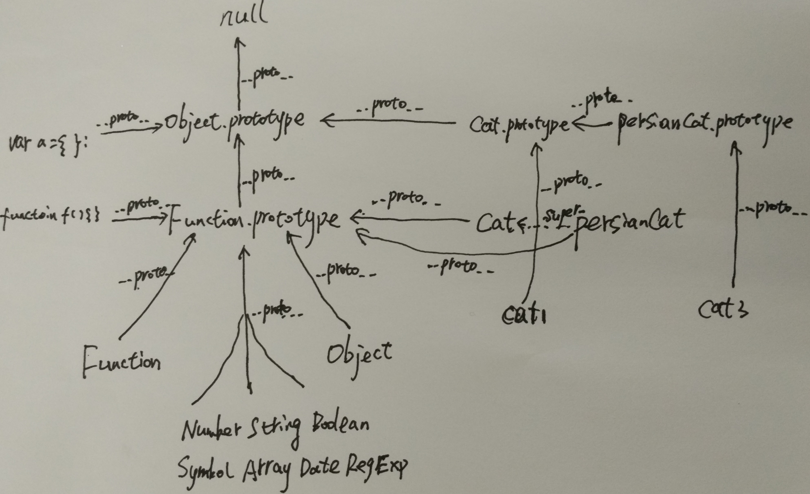

>"  
>node && js 面向对象编程  

0. OOP回顾   
    OOP是一种程序编程范型(范式即模式、方法，编程范型提供/决定了程序员对程序执行的看法)，它将**对象**作为程序的基本单元,将对象和数据封装其中，目的是提高软件的重用性、灵活性和扩展性。  
    OOP设计中，程序包含一系列相互独立又相互调用的对象。于此相对，传统面向过程把程序看成一系列函数的集合。  
    面向过程把解决问题的过程分解，用一个个的函数逐步解决问题；面向对象把问题抽象成一个个的对象，每个对象在整个问题域中的职责/行为是什么。每个对象都是一个小型的机器，有数据，有状态，有行为，能够接受数据，处理数据，传达数据。  
    从代码层面讲，两者的主要区别在于数据是单独存放还是与操作存储在一起。  
    面向对象编程三大特性：  
    **封装** 把客观事物封装成类，类是数据和操作这些数据的方法的逻辑实体  
    **继承** 复用现有的类的所有功能，并且可以对这些功能进行扩展  
    **多态** 不同内部结构的对象可以共享相同的外部接口，且通过一个共同的类，这些对象的接口可以通过相同的方式被调用  
    OOP最简单最本质的定义就是使用**对象**来做设计，但并非所有编程语言都支持OOP相关的技术与结构。

0. JS的OO(个人理解)  
    ES6新增了class, extends等关键字，但只是语法糖。JS中没有父类和子类，没有类和实例的区分。一切皆对象，所以必须跳过类和类之间的关系这一层，直接考虑对象。  
    JS是通过一种叫做*原型链模型*的技术来模拟对象之间关系（封装，继承等）。  
    对OOP的三大特性描述如下：  

    * 对于封装，在这一篇[syntax_of_node&js](./syntax_of_node&js.md)中有介绍，JS对象中可以包含任意数据类型，包括函数类型。这看起来似乎解决了把数据和对数据的操作封装在一起的问题。  
    但实际上对象之间数据共享已经问题没有解决。
    ~~~
    function Cat(name, color){
        return {
            name: name,
            color: color,
            type: 'felid',
            sayHi: function(){
                console.log(this.name + ' ' + this.color);
            }
        }
    }
    var cat1 = Cat('mimi', 'yellow');
    var cat2 = Cat('funny', 'black');
    ~~~
    这一段代码中cat1和cat2对象都封装了name和color属性，同时有type属性和sayHi方法。但是type和sayHi本应该共享，而不是各自维护。  
    对于方法，把实现写在外部，在对象中进行引用可以解决共享的问题，但是一堆完全看不出相关关系的全局方法，本身就是违反封装原则的。
    
    * 对于多态，我的理解是动态语言没有类型检查，天生就支持多态，当然是以牺牲运行效率为代价的。  
    
    * 对于继承，跳过类这一层，对象之间似乎已经不存在继承的概念了。或者说，转化成了数据封装的问题: 把父类的public数据和方法封装进子类对象中，也就是说，  
    对于'类'和'父类'私有的数据和方法，直接封装到对象中，对象单独维护一份副本；同时对象可通过某种方法，找到和其他对象共享的来自'父类'的数据和方法。对这个对象来说，这些数据和方法与来自自己的'类'的共享数据和方法是没有区别的。  
    但是从外部来看，来自'父类'的数据和方法和来自'类'的数据和方法必须区分开。因为'父类'也可能派生出多个'子类'，不同'子类'的'实例'(对象)只有来自'父类'的数据和方法是共享的，他们各自'类'的数据和方法是各异的。  
    例如，类A派生出类B和类C, a,b,c分别是他们的实例对象，那么b,c中来自类A的public数据和方法与a的必然存放在同一个地方，但是b,c中来自各自类的数据和方法(public和private)却必须分开存放。  
    假设c0也是类C的实例对象，那么c和c0之间，则应该是private数据和方法各自维护，来自类A和类C的public数据和方法共享，存放在同一个地方。  
    这样看来，对象之间所谓的继承，其实跟封装是一回事。
    
    所以在JS中，OO需要解决的问题只有一个，就是对象数据如何封装和查找的问题。解决这个问题的办法就是prototype。  
    JS规定，每个对象（一切皆对象）都有一个prototype对象，这个对象里存储就是共享的数据和方法，由对象的\__proto__属性引用(这个属性for..in打印不出,应该是实现的比较特殊)。  
    JS执行数据和方法查找时：先从自身寻找私有的数据和方法；再通过\__proto__找到prototype对象，查找来自'类'的，与'同类'对象共享的数据和方法；然后通过prototype对象的\__proto__找到来自'父类'的，与'同父类'对象共享的数据和方法。以此类推直到null。  
    这样，通过对\__proto__链的查找，就实现了类似'继承'的机制。  
    对象的prototype对象被称为原型对象, \__proto__查找链就是原型链。*JS通过原型链实现继承机制*就是这个意思。
    ~~~
    var cat1 = {name: 'mimi', color: 'yellow'};
    var share = {type: 'felid', sayHi: function(){console.log(this.name + ' ' + this.color);}};
    cat1.__proto__ = share;
    console.log('%j', cat1);
    cat1.sayHi();
    
    var cat2 = {name: 'funny', color: 'black'};
    cat2.__proto__ = share;
    console.log('%j', cat1);
    cat2.sayHi();
    ~~~
    
    JS中一个对象的\__proto__属性指向这个对象的prototype对象，这一实现是非标准的，虽然已经被添加在ES6草案中，但是不建议使用，(这里为了叙述方便直接这么使用)。可以用Object.getPrototypeOf()和Object.setPrototypeOf()代替。  
    对于对象的prototype(原型对象)，JS提供了一些辅助方法：
    ~~~
    console.log(Object.getPrototypeOf(cat1) === share);//true
    console.log(share.isPrototypeOf(cat1)); //true
    console.log(cat1.hasOwnProperty('name')); //true js中唯一一个处理属性但是不查找原型链的函数
    console.log(cat1.hasOwnProperty('type')); //false
    console.log('name' in cat1); //true
    console.log('type' in cat1); //true
    for(var prop in cat1){console.log(prop + ': ' + cat1[prop]);} //all props in cat1 and share
    ~~~
    除此之外还有一个运算符比较特别`instanceof`,用来判断某个对象的prototype属性是否在另一个要检测对象的原型链上：
    ~~~
    console.log(cat1 instanceof Cat); //true, all of these
    console.log(cat1 instanceof Object);
    console.log(Cat instanceof Function);
    console.log(Cat instanceof Object);
    console.log(Function instanceof Object);
    console.log(Function instanceof Function);
    console.log(cat3 instanceof PersianCat);
    console.log(cat3 instanceof Cat);
    ~~~
    
0. JS的OOP  
    上一节OO的原理阐述以及示例中，我们都是先有对象，再有对象的原型。这其实与原型的概念是相反的。  
    所谓原型，其实就是模具，从原型对象生成对象，而不是相反。从原型对象生成对象，JS提供了Constructor函数的概念以及new关键字。  
    Constructor其实就是普通函数，但是内部使用了this变量。从这一篇[syntax_of_node&js](./syntax_of_node&js.md)可以知道，JS中this变量的使用非常灵活。   
    Constructor配合new和this关键字，就可以完成原型对象生成对象。
    ~~~
    function Cat(name, color){
        this.name = name;
        this.color = color;
    }
    Cat.prototype.type = 'felid';
    Cat.prototype.sayHi = function(){
        console.log(this.name + ' ' + this.color);
    };
    var cat1 = new Cat('mimi', 'yellow');
    var cat2 = new Cat('funny', 'black');
    ~~~
    
    以上示例中,Cat就是Constructor函数，new关键字调用Constructor生成cat对象；所有的cat对象维护自己的name和color属性，同时共享type属性和sayHi方法。cat1，cat2和上一节的示例是一样的。  
    对于'继承'，就要用到util包的inherits方法：
    ~~~
    function PersianCat(name, color, price){
        PersianCat.super_.call(this, name, color);
        this.price = price;
    }
    var util = require('util');
    util.inherits(PersianCat, Cat);
    PersianCat.prototype.getPrice = function(){
        console.log(this.price);
    };
    
    var cat3 = new PersianCat('punpy', 'white', 1000);
    cat3.sayHi();
    cat3.getPrice();
    
    for(var prop in cat3){
        console.log('' + prop + ': ' + cat3[prop]);
    }
    /* 输出
    punpy white
    1000
    name: punpy
    color: white
    price: 1000
    getPrice: function (){
        console.log(this.price);
    }
    type: felid
    sayHi: function (){
        console.log(this.name + ' ' + this.color);
    }
    */
    ~~~
    
    可以看到上面cat3的私有属性name,color,price; 来自'类'的共享方法getPrice; 来自'父类'的共享属性和方法type,sayHi。而且布局上可以看出大致的原型链查找顺序:  
    cat1,cat2的原型对象是Cat函数对象的prototype属性; cat3的原型对象是PersianCat函数对象的prototype属性；而PersianCat.prototype的原型对象是Cat.prototype。即：  
    ~~~
    cat1.__proto__ = Cat.prototype;
    cat3.__proto__ = PersianCat.prototype;
    cat3.__proto__.__proto__ = PersianCat.prototype.__proto__ = Cat.prototype;
    ~~~
    对于new和util.inherits的原理，这一篇最后一节继续。

0. JS的原型链模型
    

0. 自由扩展
    了解JS的原型链模型之后，很多人都能嗅到自由的味道了。但是随意扩展Object.prototype或者其他内置类型的的原型对象却是一个非常不好的主意，这种技术被称为[monkey patching](http://bonsaiden.github.io/JavaScript-Garden/zh/)   
    虽然这种技术被广泛应用到一些JS类库中，比如Prototype。扩展内置类型唯一的理由是为了和新的JS特性保持一致，比如Array.forEach.(这是编程领域常用的一种方式，称之为Backport，即将新的补丁添加到老版本).   
    在实现复杂的JS应用时，要堤防原型链过长带来的性能问题，并且知道如何通过缩短原型链来提高性能。        

0. new和util.inherits原理
    ~~~
    function New(F) {
        var n = { '__proto__': F.prototype };
        return function () {
            F.apply(n, arguments);
            return n;
        }
    }
    var cat11 = New(Cat)('mimi', 'yellow'); // <==> new Cat('mimi', 'yellow’);
    ~~~
    
    ~~~
    function _inherits(F, SuperF) {
        F.prototype.__proto__ = SuperF.prototype;
        F.super_ = SuperF;
    }
    ~~~
    以上只是从现象总结的原理，实际可能比这复杂的多。

0. Object.create 
    ECMA规范只允许我们用new运算符来进行原型继承。但是Douglas大师发明了一种利用new实现的真正的原型继承方式，不需要Constructor，可以从任意类型'派生'对象：  
    这个方法的原型是这样的`Object.create(proto [, propertiesObject ])`
    ~~~
    var Point = {
        x: 0,
        y: 0,
        print: function(){console.log(this.x, this.y);}
    };
    var p = Object.create(Point);
    p.x = 20;
    p.y = 20;
    p.print(); //10 20
    ~~~
    这个方法的原理(简化版)是：
    ~~~
    function create (Parent) {
        function F() {}
        F.prototype = Parent;
        return new F();
    }
    ~~~
    可以看到这样构造对象实际上是把构造函数抛弃了，把所有属性都放在原型链上，让实例直接引用，这样子是非常节省内存的。但是这些属性是共享的，可能被其他对象修改。
    
  
    
    
    